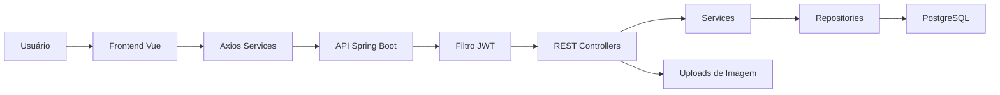
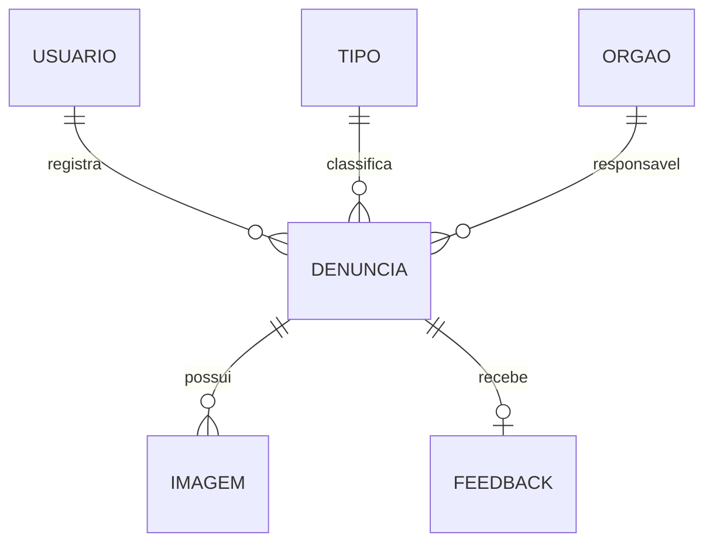

# 🏙️ Ativo Operante

O **Ativo Operante** é uma aplicação full-stack para registro e acompanhamento de denúncias urbanas. O sistema permite que cidadãos cadastrem ocorrências com tipo, órgão responsável, urgência, descrição e imagens, enquanto administradores acompanham as denúncias, gerenciam cadastros e registram feedbacks.

Este projeto representa uma evolução técnica em relação a projetos mais simples de CRUD, porque combina **frontend em Vue**, **backend Java com Spring Boot**, autenticação por **JWT**, persistência com **JPA/PostgreSQL** e relacionamentos entre entidades.

## 🎯 Objetivo

Centralizar denúncias de cidadãos e criar um fluxo simples de acompanhamento:

- o cidadão registra a denúncia;
- o sistema associa a denúncia a um tipo de problema e órgão responsável;
- o administrador consulta as ocorrências;
- o administrador registra um feedback;
- o cidadão acompanha suas próprias denúncias e respostas.

## ✨ Funcionalidades

### Cidadão

- Cadastro de usuário.
- Login com token JWT.
- Cadastro de denúncia.
- Upload opcional de imagens.
- Listagem das próprias denúncias.
- Visualização de feedbacks recebidos.

### Administrador

- Login com perfil administrativo.
- Cadastro, edição, busca e exclusão de tipos de denúncia.
- Cadastro, edição, busca e exclusão de órgãos responsáveis.
- Listagem de todas as denúncias.
- Exclusão de denúncia.
- Registro de feedback para o cidadão.

## 🧠 Diferenciais Técnicos

- Frontend em **Vue 3** com rotas protegidas por perfil.
- Comunicação HTTP com **Axios**.
- Backend em **Spring Boot** com API REST.
- Autenticação com **JWT**.
- Filtro de acesso separando rotas de cidadão e administrador.
- Persistência com **Spring Data JPA**.
- Banco **PostgreSQL**.
- Upload de imagens via `MultipartFile`.
- Relacionamentos JPA entre denúncia, usuário, tipo, órgão, imagens e feedback.
- Separação em camadas: controllers, services, repositories, entities e security.

## 🧱 Arquitetura



## 🗃️ Modelo de Dados



## 🛠️ Tecnologias Utilizadas

### Backend

- **Java 24**
- **Spring Boot**
- **Spring Web**
- **Spring Data JPA**
- **PostgreSQL**
- **JWT**
- **Maven**

### Frontend

- **Vue 3**
- **Vue Router**
- **Axios**
- **JavaScript**
- **HTML/CSS**

## 📁 Estrutura do Projeto

```text
ProjetoAtivoOperanteVue/
├── backend/
│   ├── src/main/java/com/example/projeto2bi_fciii/
│   │   ├── entities/           # Entidades JPA
│   │   ├── repositories/       # Spring Data repositories
│   │   ├── restcontrollers/    # Endpoints REST
│   │   ├── security/           # JWT e filtro de acesso
│   │   └── services/           # Regras de negócio
│   ├── src/main/resources/
│   │   └── application.properties
│   └── pom.xml
├── frontend/
│   ├── src/
│   │   ├── components/         # Componentes reutilizáveis
│   │   ├── router/             # Rotas protegidas
│   │   ├── services/           # Integração com API
│   │   ├── utils/              # Token, validações e imagens
│   │   └── views/              # Telas da aplicação
│   └── package.json
└── README.md
```

## 🚀 Como Executar

### 1. Pré-requisitos

- JDK compatível com o `pom.xml`.
- PostgreSQL.
- Node.js e npm.

### 2. Banco de Dados

Crie um banco local:

```powershell
createdb -U postgres ativooperante
```

Configure o backend com variáveis de ambiente:

```powershell
$env:DATABASE_URL="jdbc:postgresql://localhost:5432/ativooperante"
$env:DATABASE_USERNAME="postgres"
$env:DATABASE_PASSWORD="sua_senha"
$env:APP_JWT_SECRET="uma-chave-de-desenvolvimento-com-mais-de-32-caracteres"
```

O arquivo [backend/.env.example](backend/.env.example) mostra as variáveis esperadas.

### 3. Rodar o Backend

```powershell
cd backend
.\mvnw.cmd spring-boot:run
```

A API sobe em:

```text
http://localhost:8080
```

### 4. Rodar o Frontend

Em outro terminal:

```powershell
cd frontend
npm install
npm run serve
```

O frontend sobe normalmente em:

```text
http://localhost:8081
```

Se a API estiver em outra URL, configure:

```powershell
$env:VUE_APP_API_URL="http://localhost:8080"
```

## 🔐 Rotas Principais da API

### Acesso

- `POST /acesso/logar`
- `POST /acesso/cadastrar`

### Cidadão

- `POST /apis/cidadao/denuncias`
- `GET /apis/cidadao/denuncias`
- `GET /apis/cidadao/feedbacks`
- `GET /apis/cidadao/get-all-orgaos`
- `GET /apis/cidadao/get-all-tipos`

### Administrador

- `GET /apis/adm/get-all-denuncias`
- `DELETE /apis/adm/denuncias/{id}`
- `PUT /apis/adm/denuncias/{id}/feedback`
- `GET /apis/adm/get-all-tipos`
- `POST /apis/adm/tipos`
- `PUT /apis/adm/tipos`
- `DELETE /apis/adm/tipos/{id}`
- `GET /apis/adm/get-all-orgaos`
- `POST /apis/adm/orgaos`
- `PUT /apis/adm/orgaos`
- `DELETE /apis/adm/orgaos/{id}`

## 🧹 Organização do Repositório

O repositório ignora:

- `backend/target/`
- `backend/uploads/`
- `frontend/node_modules/`
- `frontend/dist/`
- arquivos `.env`
- configurações locais de IDE

Assim, o GitHub fica focado no que importa: código-fonte, configuração de exemplo e documentação.

## 🔮 Melhorias Futuras

- Hash de senha no cadastro e login.
- Refresh token ou sessão mais longa.
- Painel com métricas por tipo de denúncia e órgão.
- Testes automatizados no backend.
- Testes de componentes no frontend.
- Armazenamento externo para imagens.
- Página pública de acompanhamento por protocolo.
